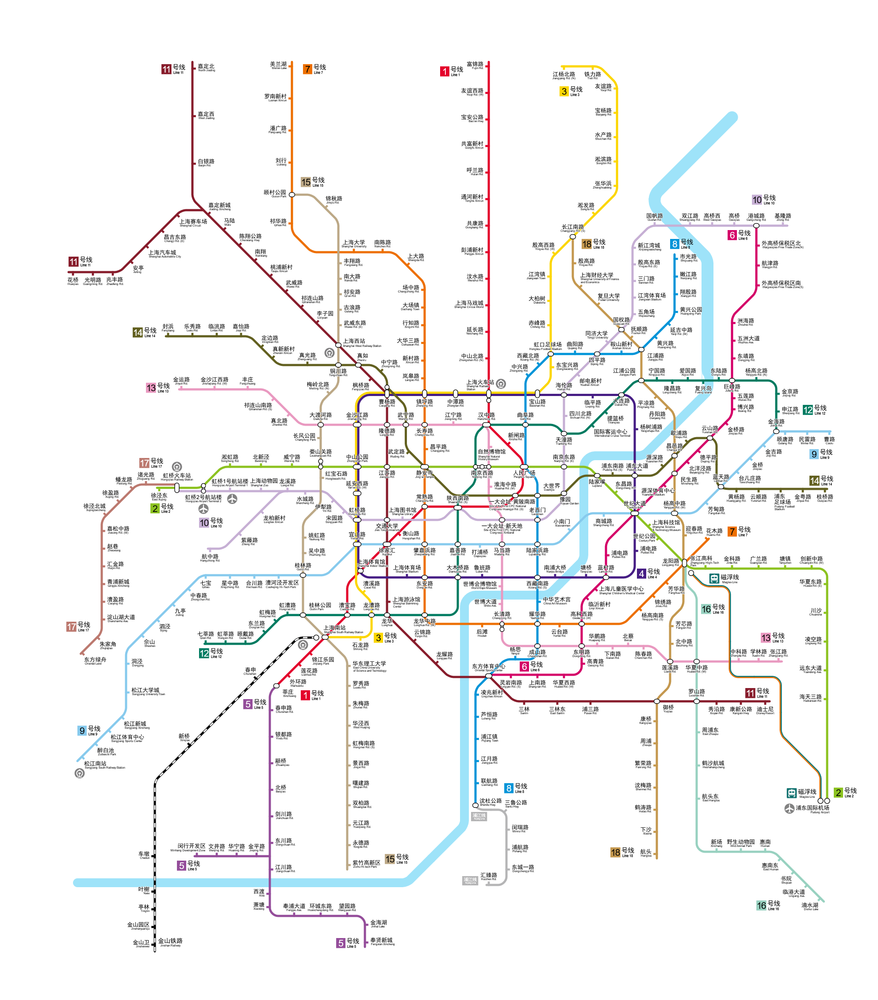

# Rail Map Painter

Rail Map Painter is an open-source React project aimed at making the process of creating custom rail maps easy and fun. This tool provides an interactive SVG canvas where users can add stations, connect them using lines, and customize their maps with a wide array of icons from different cities.

> Branches are renamed in v5 release. For more information see [here](./docs/developer-guide.md#rename-your-local-branches)

## Table of Contents

- [Features](#features)
- [Projects Selected](#works-selected)
- [Getting Started](#getting-started)
  - [Online Website](#online-website)
  - [Offline Applications](#offline-applications)
- [Usage](#usage)
- [Contributing](#contributing)
- [License](#license)
- [One More Thing](#one-more-thing)

## Features

- Interactive SVG canvas to design custom rail maps
- Drag-and-drop stations from a large resource library of icons from different cities
- Connect stations using 135-degree rounded corner or perpendicular lines
- Export your creations as SVG, PNG, or JSON files
- Available as a web app hosted on GitHub Pages and as an offline applications

## Works Selected

Note all images are generated via the interactive web application where you can move, add, change, delete any stations and lines!

> Shanghai

> Guangzhou

> Beijing

> Hong Kong

More works can be found at [Rail Map Painter Gallery](https://railmapgen.org/?app=rmp-gallery) where contributors like you upload and update these great works!

## Getting Started

### Online Website

Simply visit the [Rail Map Painter](https://railmapgen.org/?app=rmp) to start designing your rail map.

### Offline Applications

Download the offline applications from the Rail Map Toolkit [releases page](https://github.com/railmapgen/railmapgen.github.io/releases).

## Usage

1. Browse the left side tool box and drop stations onto the canvas.
2. Select and drag to connect stations using 135-degree rounded corner or perpendicular lines.
3. Use the details panel to change line paths and styles.
4. Customize your map with labels, facilities, and line badges.
5. Save your creation as an SVG, PNG, or JSON file.

## Contributing

We welcome contributions to the Rail Map Painter project! Please read our [Contributing Guide](./CONTRIBUTING.md) for more information on reporting issues and developing features.

## License

Rail Map Painter is released under the [GPL-3.0 License](./LICENSE).

## One More Thing

This doc is generated by ChatGPT-4 with some description prompts and polished by thekingofcity. Everything above should be considered verified and authentic.
